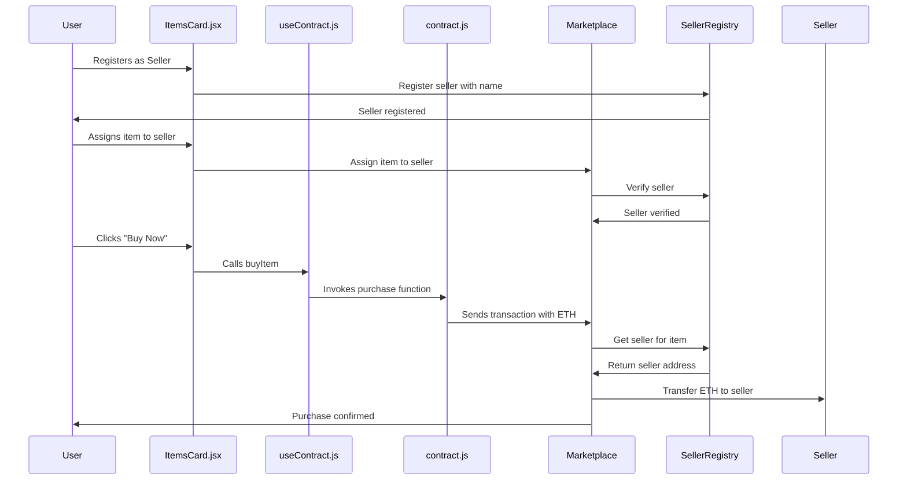

# 🛒 Simple Onchain Marketplace

A decentralized marketplace where users can **buy items using cryptocurrency (ETH)** through **smart contracts** deployed on the blockchain. Features include **seller registration**, **payment routing to sellers**, and **on-chain purchase tracking**.

This project demonstrates how to **connect multiple smart contracts to a frontend application** using Next.js, Hardhat, and the Base Sepolia testnet.

## 🎥 Demo Video

https://github.com/oyingrace/simple-onchain-marketplace/blob/main/public/demo-video.mp4

---

## ⚙️ How It All Works



---

## 🚀 Getting Started

### 1. Clone the Repository

```bash
git clone https://github.com/oyingrace/simple-onchain-marketplace.git
cd simple-onchain-marketplace
npm install
```

### 2. Get Testnet ETH

Go to [Base Faucets](https://docs.base.org/base-chain/tools/network-faucets) and request Base Sepolia ETH test tokens to your wallet.

### 3. Environment Setup

Create a `.env.local` file in the root directory:

```bash
cp .env.example .env.local
```

Fill in the values:

```env
PRIVATE_KEY=your-wallet-private-key
ALCHEMY_RPC=your-alchemy-network-url
NEXT_PUBLIC_WALLETCONNECT_PROJECT_ID=your-walletconnect-project-id
```

**Where to get these values:**

- **PRIVATE_KEY**: From the wallet that holds Base Sepolia ETH test tokens
- **ALCHEMY_RPC**: From Alchemy
  1. Sign up at [Alchemy](https://www.alchemy.com/)
  2. Create an app
  3. Select Base as the chain, Sepolia as the network
  4. Copy the HTTP URL and paste it here
- **NEXT_PUBLIC_WALLETCONNECT_PROJECT_ID**: From WalletConnect
  1. Go to [WalletConnect Dashboard](https://dashboard.reown.com/)
  2. Create a new project
  3. Copy the Project ID and paste it here

### 4. Deploy the Smart Contracts

Run the deployment script to deploy both contracts:

```bash
npx hardhat run scripts/deploy.ts --network baseSepolia
```

The script will deploy:
1. **SellerRegistry** - Manages seller registration and item-to-seller mapping
2. **SimpleMarketplace** - Handles purchases and payment routing

Copy both deployed contract addresses from the output.

Update `lib/contract.js` with your deployed contract addresses:

```javascript
const MARKETPLACE_ADDRESS = '0xYourMarketplaceAddress';
const SELLER_REGISTRY_ADDRESS = '0xYourSellerRegistryAddress';
```

**Important**: The Marketplace contract requires the SellerRegistry address in its constructor, so SellerRegistry must be deployed first (which the script does automatically).

### 5. Run the Frontend

Start the development server:

```bash
npm run dev
```

Visit [http://localhost:3000](http://localhost:3000) to interact with the app.

### 6. Using the Marketplace

#### For Sellers:
1. **Connect your wallet** using WalletConnect
2. **Register as a seller** by clicking "Register as Seller" and entering your seller name
3. **Assign items to yourself** (you'll need to implement this or use a script)
4. **Receive payments** directly to your wallet when items are purchased

#### For Buyers:
1. **Connect your wallet** using WalletConnect
2. **Browse items** with seller information displayed
3. **Click "Buy Now"** to purchase items with ETH
4. **Confirm transaction** in your wallet
5. **Payment goes directly to the seller**

---

## 🧰 Tech Stack

- **Smart Contracts**: Solidity, Hardhat
- **Blockchain**: Base Sepolia Testnet
- **Frontend**: React, Next.js, Tailwind CSS
- **Web3 Provider**: Alchemy
- **Wallet Integration**: WalletConnect (supports 300+ wallets)

---

## 📁 Project Structure

```
simple-onchain-marketplace/
├── contracts/
│   ├── SimpleMarketplace.sol    # Main marketplace contract
│   └── SellerRegistry.sol        # Seller registration contract
├── lib/
│   ├── contract.js               # Smart contract integration
│   ├── useContract.js            # React hook for contract
│   └── walletConnectConfig.js    # WalletConnect configuration
├── app/
│   ├── components/
│   │   └── ItemsCard.jsx         # Main marketplace component
│   ├── layout.js
│   └── page.js
├── scripts/
│   └── deploy.ts                 # Deployment script
└── hardhat.config.ts
```

---

## ✅ Features

- **Wallet Connection**: Connect 300+ wallets via WalletConnect to Base Sepolia testnet
- **Seller Registration**: Register as a seller with a custom name
- **Item Display**: Show marketplace items with images, prices, and seller information
- **Payment Routing**: Payments automatically go to sellers' wallets (not stuck in contract)
- **Purchase Functionality**: Buy items directly with ETH through smart contract
- **Transaction Confirmation**: Real-time transaction status and confirmation
- **Network Management**: Automatic network switching to Base Sepolia
- **Error Handling**: User-friendly error messages and validation
- **On-Chain Seller Tracking**: All sellers and item assignments stored on blockchain

---

## 🔧 Smart Contract Functions

### Marketplace Contract

#### `buyItem(uint256 _itemId, string _itemName)`
- Allows users to purchase items by sending ETH
- Automatically routes payment to the item's seller
- Records the purchase with buyer and seller information
- Emits an event with purchase details

#### `assignItemToSeller(uint256 _itemId, address _seller)`
- Assigns an item to a registered seller
- Only registered sellers can have items assigned
- Links item ID to seller address

#### `getPurchases()`
- Returns an array of all purchases made
- Includes item ID, name, price, buyer address, and seller address

#### `getSellerForItem(uint256 _itemId)`
- Returns the seller address for a specific item
- Returns zero address if item is not assigned

### Seller Registry Contract

#### `registerSeller(string _name)`
- Registers a wallet address as a seller
- Requires a unique seller name
- Emits an event when seller is registered

#### `getSeller(address _seller)`
- Returns seller information (address, name, registration status, item count)

#### `getSellerForItem(uint256 _itemId)`
- Returns the seller address assigned to an item

#### `isSeller(address _seller)`
- Checks if an address is a registered seller
- Returns boolean value

---

## 🚨 Important Notes

- **Testnet Only**: This project uses Base Sepolia testnet for development
- **Wallet Required**: Users need any WalletConnect-compatible wallet (300+ options)
- **Gas Fees**: Transactions require small amounts of test ETH for gas fees
- **Network Switching**: The app automatically prompts users to switch to Base Sepolia
- **Seller Registration**: Items must be assigned to registered sellers before they can be purchased
- **Payment Routing**: All payments go directly to sellers' wallets, not to the contract address
- **Two Contracts**: The marketplace uses two contracts: SellerRegistry and SimpleMarketplace

---

## 🐛 Troubleshooting

### Common Issues:

1. **"Failed to initialize WalletConnect"**
   - Check your WalletConnect Project ID in environment variables
   - Ensure you have a valid project ID from dashboard.reown.com

2. **"Wrong network"**
   - The app will prompt you to switch to Base Sepolia

3. **"Insufficient funds"**
   - Get test ETH from Base Sepolia faucet

4. **"Item not assigned to a seller"**
   - Items must be assigned to a registered seller before purchase
   - Use the `assignItemToSeller` function after seller registration

5. **"Seller not registered"**
   - Register as a seller first using the "Register as Seller" button
   - Ensure you're connected with the wallet you want to register

6. **Import errors**
   - Ensure all file paths are correct
   - Check that `.js` extensions are used for imports

7. **Contract address errors**
   - Make sure both MARKETPLACE_ADDRESS and SELLER_REGISTRY_ADDRESS are set in `lib/contract.js`
   - Verify addresses match your deployed contracts

---

## 📜 License

This project is open-source under the MIT License.
Leave a star if you find this project helpful.
