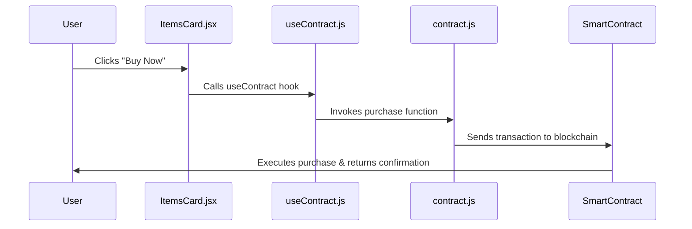

# 🛒 Simple Onchain Marketplace

A simple decentralized marketplace where users can **buy items using cryptocurrency (ETH)** through a **smart contract** deployed on the blockchain.  

This project demonstrates how to **connect a smart contract to a frontend application** using Next.js, Hardhat, and the Base Sepolia testnet.

## 🎥 Demo Video

https://github.com/oyingrace/simple-onchain-marketplace/blob/main/public/demo-video.mp4

---

## ⚙️ How It All Works



---

## 🚀 Getting Started

### 1. Clone the Repository

```bash
git clone https://github.com/yourusername/simple-onchain-marketplace.git
cd simple-onchain-marketplace
npm install
```

### 2. Get Testnet ETH

Go to [Base Faucets](https://docs.base.org/base-chain/tools/network-faucets) and request Base Sepolia ETH test tokens to your wallet.

### 3. Environment Setup

Create a `.env.local` file in the root directory:

```bash
cp .env.example .env.local
```

Fill in the values:

```env
PRIVATE_KEY=your-wallet-private-key
ALCHEMY_RPC=your-alchemy-network-url
```

**Where to get these values:**

- **PRIVATE_KEY**: From the wallet that holds Base Sepolia ETH test tokens
- **ALCHEMY_RPC**: From Alchemy
  1. Sign up at [Alchemy](https://www.alchemy.com/)
  2. Create an app
  3. Select Base as the chain, Sepolia as the network
  4. Copy the HTTP URL and paste it here

### 4. Deploy the Smart Contract

Run the deployment script:

```bash
npx hardhat run scripts/deploy.ts --network baseSepolia
```

Copy the deployed contract address from the output.

Update `lib/contract.js` with your deployed contract address:

```javascript
const CONTRACT_ADDRESS = '0xYourDeployedContractAddress';
```

### 5. Run the Frontend

Start the development server:

```bash
npm run dev
```

Visit [http://localhost:3000](http://localhost:3000) to interact with the app.

---

## 🧰 Tech Stack

- **Smart Contracts**: Solidity, Hardhat
- **Blockchain**: Base Sepolia Testnet
- **Frontend**: React, Next.js, Tailwind CSS
- **Web3 Provider**: Alchemy
- **Wallet Integration**: MetaMask

---

## ✅ Features

- **Wallet Connection**: Connect MetaMask to Base Sepolia testnet
- **Item Display**: Show marketplace items with images and prices
- **Purchase Functionality**: Buy items directly with ETH through smart contract
- **Transaction Confirmation**: Real-time transaction status and confirmation
- **Network Management**: Automatic network switching to Base Sepolia
- **Error Handling**: User-friendly error messages and validation

---

## 🔧 Smart Contract Functions

### `buyItem(uint256 _itemId, string _itemName)`
- Allows users to purchase items by sending ETH
- Records the purchase in the contract
- Emits an event with purchase details

### `getPurchases()`
- Returns an array of all purchases made
- Includes item ID, name, price, and buyer address

---

## 🚨 Important Notes

- **Testnet Only**: This project uses Base Sepolia testnet for development
- **MetaMask Required**: Users need MetaMask or a compatible wallet
- **Gas Fees**: Transactions require small amounts of test ETH for gas fees
- **Network Switching**: The app automatically prompts users to switch to Base Sepolia

---

## 🐛 Troubleshooting

### Common Issues:

1. **"MetaMask is not installed"**
   - Install MetaMask browser extension

2. **"Wrong network"**
   - The app will prompt you to switch to Base Sepolia

3. **"Insufficient funds"**
   - Get test ETH from Base Sepolia faucet

4. **Import errors**
   - Ensure all file paths are correct
   - Check that `.js` extensions are used for imports

---

## 📜 License

This project is open-source under the MIT License.
Leave a star if you find this project helpful.
